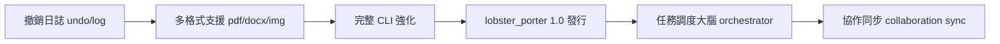

# lobster_porter 開發進度簡報

> **更新日期：** 2026 年 4 月 16 日  
> **分支：** `main`  
> **版本：** 0.9 Beta → 目標 1.0

---

## ✅ 已完成模組

<AccordionGroup>
  <Accordion title="批量搬運（batch_move / batch_copy）" icon="check" defaultOpen>
    **狀態：已完成並可用**

    - `batch_move(src, dst, pattern)` — 支援萬用字元、遞迴搬運
    - `batch_copy(src, dst, pattern)` — 保留原始檔，建立副本
    - 支援衝突策略：`skip`（跳過）、`overwrite`（覆蓋）、`rename`（自動重命名）
    - 已通過基礎功能測試

    **可立即用於：** 劇本稿、分鏡圖、美術設計稿、Prompt 文件的批量整理
  </Accordion>

  <Accordion title="批量分類策略（strategies）" icon="check">
    **狀態：已完成，持續優化**

    | 策略名稱 | 說明 |
    |---|---|
    | `by_extension` | 依副檔名分類（`.txt`, `.md`, `.pdf`, …） |
    | `by_date` | 依建立或修改日期歸檔 |
    | `by_keyword` | 依檔名關鍵字分流到對應目錄 |
    | `by_regex` | 用正規表達式自訂分類規則 |

    已支援多策略疊加（先分副檔名，再按日期細分）
  </Accordion>

  <Accordion title="插件機制（plugin system）" icon="check">
    **狀態：架構完成，基礎插件可用**

    - 插件介面規範（`BasePlugin`）已定義
    - `example_plugin.py` 示範插件已建立，說明如何擴充
    - 插件透過設定檔動態載入，不需修改核心程式碼
    - 已通過基礎插件載入測試
  </Accordion>

  <Accordion title="命令列介面（CLI 基礎版）" icon="check">
    **狀態：基礎可用**

    - 支援 `move`、`copy`、`classify` 子命令
    - 支援 `--strategy`、`--plugin`、`--dry-run`（預覽模式）參數
    - 基礎說明文件（`--help`）已齊全
  </Accordion>

  <Accordion title="套件結構與基礎設定" icon="check">
    **狀態：已完成**

    - `__init__.py`、`core.py`、`strategies.py`、`plugins/__init__.py` 均已建立並含注解
    - `setup.py` / `pyproject.toml` 已完成基礎設定
    - 基礎單元測試框架已建立
  </Accordion>
</AccordionGroup>

---

## 🚧 進行中模組

<AccordionGroup>
  <Accordion title="撤銷與操作日誌（undo / audit log）" icon="clock" defaultOpen>
    **狀態：架構設計中，尚未實作**

    - **設計方向：** 每次搬運/分類前記錄操作快照，支援一鍵還原
    - **缺口：** `undo_stack` 資料結構、操作序列化、回滾執行器
    - **風險：** 無此功能時大量誤操作難以還原，正式生產環境建議等待此模組完成

    **預計完成：** 1.0 版本核心功能，優先級高
  </Accordion>

  <Accordion title="多格式檔案支援" icon="clock">
    **狀態：基礎 txt/md 已支援，其他格式待補**

    | 格式 | 狀態 |
    |---|---|
    | `.txt` / `.md` | ✅ 完整支援 |
    | `.pdf` | 🚧 插件骨架已建，解析器待整合 |
    | `.docx` / `.xlsx` | 🚧 需接入 python-docx / openpyxl |
    | 圖片（`.jpg`, `.png`, `.tiff`） | 🚧 需接入 Pillow 或 ImageMagick |
    | 影音（`.mp4`, `.mov`, `.wav`） | ❌ 尚未規劃 |
    | AI 美術專案（`.psd`, `.clip`） | ❌ 尚未規劃 |

    **預計完成：** 分批進入 1.x 版本
  </Accordion>
</AccordionGroup>

---

## ❌ 尚缺核心模組

<AccordionGroup>
  <Accordion title="協作同步（collaboration sync）" icon="x">
    **狀態：未開始**

    目前系統為純本機單機作業。若需多人協同或雲端同步，需開發：
    - 衝突偵測與合併策略（類 Git diff）
    - 雲端儲存適配器（Google Drive、S3、Dropbox）
    - 網路傳輸層（WebSocket / HTTP API）
    - 權限控管模組

    **預計時程：** 1.5 版本以後
  </Accordion>

  <Accordion title="任務調度大腦（orchestrator / scheduler）" icon="x">
    **狀態：概念設計完成，尚未實作**

    俗稱「龍蝦大腦」——讓龍蝦搬運工從單次工具升級為全流程自動化引擎：
    - 任務池（task queue）與依賴樹執行（先分類再搬運）
    - 非同步/平行任務執行器
    - 事件觸發（完成 A 自動觸發 B）
    - 任務狀態記錄（queued → running → done/failed）
    - 重試機制與錯誤恢復策略
    - 統一任務監控介面（CLI 或 Web dashboard）

    **預計時程：** 1.2 版本
  </Accordion>

  <Accordion title="完整錯誤追蹤與告警" icon="x">
    **狀態：僅有基礎 stderr 輸出**

    - 需要結構化日誌（JSON log）
    - 需要告警機制（email / webhook 通知）
    - 需要操作歷程完整審計軌跡
    - 需要失敗重試記錄與報告

    **預計時程：** 1.1 版本
  </Accordion>

  <Accordion title="配置檔案熱重載與 GUI 設定介面" icon="x">
    **狀態：未開始**

    - 目前需手動修改設定檔並重啟程序
    - 計畫支援 YAML/TOML 設定熱重載
    - 長遠目標：簡易 Web 設定介面

    **預計時程：** 1.3 版本
  </Accordion>
</AccordionGroup>

---

## 優先補完建議（1.0 發行路線圖）

| 優先級 | 模組 | 預計版本 | 說明 |
|---|---|---|---|
| 🔴 最高 | 撤銷 / 審計日誌 | 1.0 | 生產安全必備 |
| 🔴 最高 | PDF / DOCX 格式支援 | 1.0 | 電影製作主流格式 |
| 🟡 高 | 完整 CLI 強化 | 1.0 | 腳本整合必要 |
| 🟡 高 | 結構化日誌與告警 | 1.1 | 可觀測性 |
| 🟢 中 | 任務調度大腦 | 1.2 | 自動化升級 |
| 🟢 中 | 影音格式支援 | 1.2 | 後製需求 |
| 🔵 低 | 協作同步 | 1.5 | 多人協作 |
| 🔵 低 | GUI 設定介面 | 1.3 | 易用性提升 |
