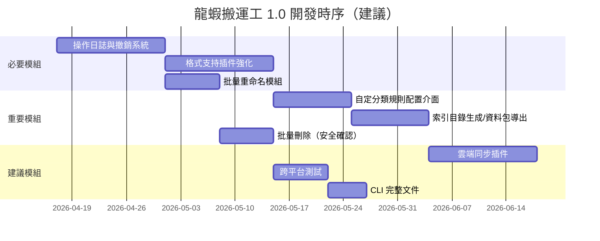

# 龍蝦搬運工 1.0 版本路線圖

本頁列出從現有實作邁向 **1.0 完整可用版本**所需完成的所有模組，並標示電影製作落地的開發優先順序。

---

## 現有基礎（已完成）

| 模組 | 描述 | 狀態 |
|------|------|------|
| 批量移動 / 複製引擎 | 支援規則驅動批量搬移或複製檔案，含 dry-run 模式 | ✅ 完成 |
| 批量分類策略 | 可擴展分類策略，支援副檔名、前綴、部門代碼等規則 | ✅ 完成 |
| 批量標籤管理 | 為檔案加上結構化標籤，支援插件化標籤策略 | ✅ 完成 |
| 基礎 CLI 介面 | `move`、`copy`、`classify`、`tag` 子命令 | ✅ 完成 |
| 插件系統框架 | 插件載入、生命週期管理、範例插件 | ✅ 完成 |

---

## 1.0 需完成的模組

### 🔴 必要模組（阻塞生產環境使用）

<AccordionGroup>
  <Accordion title="操作日誌與撤銷系統" icon="clock-rotate-left">
    **描述：** 記錄每次批量操作的完整參數，支援單步及多步撤銷。

    **子任務：**
    - [ ] 設計操作日誌數據結構（JSON Lines 格式）
    - [ ] 實作 `OperationLogger` 類，掛入 mover / classifier / tagger 生命週期
    - [ ] 實作 `UndoManager`，支援 `lobster undo` CLI 命令
    - [ ] 日誌導出命令 `lobster log export --format csv|json`
    - [ ] 單元測試與整合測試

    **電影製作重要性：** 沒有此功能，技術製片無法允許工具在生產素材目錄上執行批量操作。
  </Accordion>

  <Accordion title="格式支持插件強化" icon="file-lines">
    **描述：** 為電影製作常用格式提供內容解析插件，讓分類規則可基於文件內容而非僅依賴副檔名。

    **子任務：**
    - [ ] 腳本格式插件：`.fdx`（Final Draft）、`.fountain` 解析，提取場景編號
    - [ ] PDF 元數據插件：讀取標題、版次字段用於分類
    - [ ] 影像序列插件：識別 `{shot}_{version}.{frame}.{ext}` 格式，按鏡頭 / 版次歸類
    - [ ] `.docx` / `.xlsx` 元數據讀取插件
    - [ ] 插件 API 文件更新

    **電影製作重要性：** 製作現場超過 60% 的素材使用以上格式，缺乏對應支援將嚴重限制自動分類的實用性。
  </Accordion>

  <Accordion title="批量重命名模組" icon="pen-to-square">
    **描述：** 模板化批量重命名，支援預覽與撤銷。

    **子任務：**
    - [ ] 設計重命名模板語法（`{project}_{scene}_{shot}_{version}.{ext}`）
    - [ ] 實作 `Renamer` 類，支援正規表達式提取命名成分
    - [ ] CLI 命令 `lobster rename --template "..."` 加 `--dry-run` 模式
    - [ ] 與操作日誌整合（重命名操作可撤銷）
    - [ ] 測試套件

    **電影製作重要性：** 交付電視台 / 串流平台時，命名規範嚴格，此模組是高頻使用功能。
  </Accordion>
</AccordionGroup>

### 🟡 重要模組（提升實用性）

<AccordionGroup>
  <Accordion title="自定分類規則配置介面" icon="sliders">
    **描述：** YAML / JSON 規則配置文件，支援非技術人員自訂分類規則。

    **子任務：**
    - [ ] 定義規則配置 JSON Schema
    - [ ] 規則解析器，支援萬用字元、正規表達式、元數據條件
    - [ ] CLI 命令 `lobster config add-rule / list-rules / remove-rule`
    - [ ] 規則配置範例文件（電影製作場景）
    - [ ] 文件更新

    **預期效果：** 製片助理可自行設定「凡帶有 `FINAL` 字樣的 PSD 自動移至 `/delivery/artwork/`」等規則，無需開發人員介入。
  </Accordion>

  <Accordion title="索引目錄自動生成 / 資料包導出" icon="folder-tree">
    **描述：** 掃描目錄生成結構化索引，並支援按規則打包導出。

    **子任務：**
    - [ ] 實作 `Indexer` 類，生成 Markdown / CSV / HTML 索引報告
    - [ ] CLI 命令 `lobster index --format md|csv|html`
    - [ ] 資料包打包命令 `lobster pack --rule "..."` 輸出 ZIP / tar
    - [ ] 增量導出模式（僅打包自上次操作以來的變更）
    - [ ] 測試套件

    **預期效果：** 送審版打包從半天壓縮至 10 分鐘。
  </Accordion>

  <Accordion title="批量刪除（含安全確認）" icon="trash">
    **描述：** 批量刪除過期素材，強制要求確認步驟及操作日誌記錄。

    **子任務：**
    - [ ] 實作 `Deleter` 類，支援規則篩選 + 強制 dry-run 預覽
    - [ ] 雙重確認機制（輸入 `DELETE` 字串方可執行）
    - [ ] 與操作日誌整合（支援查閱已刪除清單）
    - [ ] 測試套件

    **注意：** 不實作「從日誌復原已刪除檔案」功能，刪除操作僅記錄，不可逆。
  </Accordion>
</AccordionGroup>

### 🟢 建議模組（擴展至完整製作管線）

<AccordionGroup>
  <Accordion title="跨平台 / 雲端同步插件" icon="cloud-arrow-up">
    **描述：** 提供 `CloudSyncPlugin` 抽象基類及官方範例插件（AWS S3、Google Drive）。

    **子任務：**
    - [ ] 定義 `CloudSyncPlugin` 介面
    - [ ] AWS S3 範例插件（使用 `boto3`）
    - [ ] Google Drive 範例插件（使用 Google Drive API）
    - [ ] CLI 命令 `lobster sync --plugin s3 --config s3.yaml`
    - [ ] 增量同步與衝突偵測邏輯
  </Accordion>

  <Accordion title="完整 CLI 幫助文件與 man page" icon="terminal">
    **描述：** 確保所有命令都有完整的 `--help` 輸出、使用範例及 man page。

    **子任務：**
    - [ ] 審查所有現有 CLI 命令的 `--help` 內容
    - [ ] 補充使用範例（電影製作場景）
    - [ ] 生成 man page（`lobster-move(1)`、`lobster-classify(1)` 等）
  </Accordion>

  <Accordion title="跨平台測試（Windows / macOS / Linux）" icon="desktop">
    **描述：** 確保路徑處理、檔案權限等在三大平台上的一致性。

    **子任務：**
    - [ ] 設定 GitHub Actions 矩陣測試（ubuntu / macos / windows）
    - [ ] 修復平台相關的路徑分隔符問題
    - [ ] 文件補充各平台安裝說明
  </Accordion>
</AccordionGroup>

---

## 1.0 完成標準（Definition of Done）

<Check>批量移動 / 複製 / 分類 / 標籤 / 重命名皆支援 dry-run 預覽</Check>
<Check>所有批量操作均記錄於操作日誌，並支援撤銷</Check>
<Check>電影製作常用格式（`.fdx`、`.pdf`、`.docx`、影像序列）有對應插件</Check>
<Check>分類規則可透過配置文件定義，無需修改核心代碼</Check>
<Check>索引目錄生成與資料包導出可用</Check>
<Check>所有核心模組有單元測試，覆蓋率 ≥ 80%</Check>
<Check>CLI `--help` 文件完整，包含電影製作使用範例</Check>
<Check>在 Ubuntu / macOS / Windows 上均通過測試</Check>

---

## 開發時序建議

<Note>
以上時序以單名工程師全時間投入估算。電影製作急用場景可先行交付**操作日誌 + 撤銷系統**及**批量重命名模組**，其餘模組排入後續衝刺週期。
</Note>
